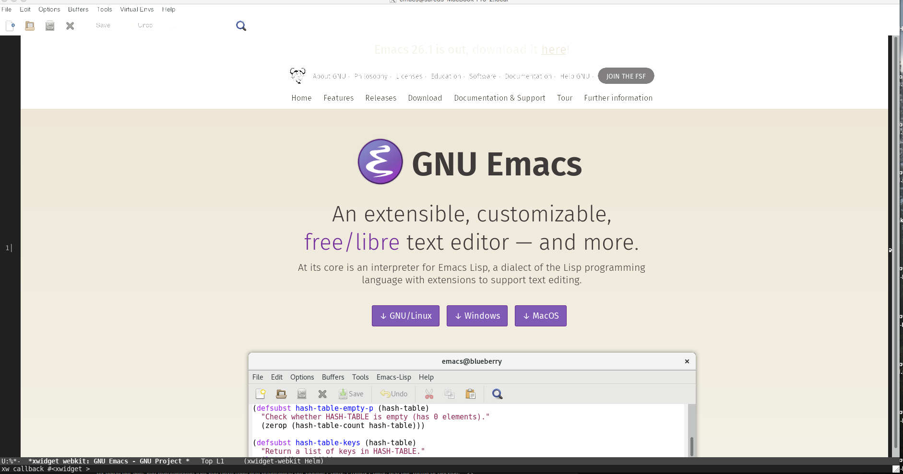

## Bleeding Edge: Emacs 25.3 with xwidget
### Why?

The purpose of building Emacs with xwidget is to make it possible to use the command "xwidget-webkit-browse-url".  This command allows users to open web-pages inside of Emacs without ever having to leave Emacs.  I have included configuration settings for navigating web-pages in my init.el file included in this Github repository.

### Requirements

Before starting it is very important to make sure that both your Homebrew and MacPort installations are fully updated.  As they will be needed for the installation of the following packages: autoconf, automake, gtk3, & webkitgtk.  

#### Homebrew
makeinfo can also be installed from Homebrew:
```bash
brew install texinfo
```

But before building Emacs, you need to get it into your $PATH ahead of /usr/bin/makeinfo
The following exports should be added to your bashrc or bash_profile.
```bash
export PATH=/usr/local/opt/texinfo/bin:$PATH
export LDFLAGS=-L/usr/local/opt/texinfo/lib
```

This package is needed if you want the --with-gnutls flag to work correctly when you build emacs.  
Gnutls allows for the use of the package-list-packages function in emacs.
```bash
brew install gnutls
```

This package is needed for Emacs to build with the flag "--with-xwidget".
```bash
brew install gtk+3
```

#### MacPorts
This package is also needed for Emacs to build with the flag "--with-xwidget".
```bash
port install webkit-gtk3
``` 

### Building Emacs

I Chose to store my build path local Applications folder.  Feel free to store where ever is convenient for you.  
```
/Users/jared3701/Applications/emacs/
```

Once you have the prerequisites squared away, the build is the same as it’s been for a while. Get the source:  
```bash
cd /Users/jared3701/Applications/
git clone git://git.savannah.gnu.org/emacs.git
cd emacs
```

Checkout the emacs-25 branch (master is the development branch):  
```bash
git checkout emacs-25
```

__Configuration Settings:__  
These are the configuration settings that I used for this project.  
```bash
./autogen.sh all
./configure --with-xwidgets --without-ns --with-gnutls --with-imagemagick --without-dbus --with-x
make install
```

Unless you specify a path emacs will be installed in the following location when using "make install" with the following configuration.  
```
/usr/local/bin/
```

### XQuartz

If running emacs from /usr/local/bin/ starts in no window mode then you must start XQuartz and point it to emacs.  
```bash
XQuartz
```

Inside of XQuartz run the 'Add Item' command.  
```
Applicaion -> Customize. -> Add Item
```


The new item requires a Name and Command to be associated with it.  
```
Name: emacs
Command: /usr/local/bin/emacs
```


I was experiencing errors with C-space for the Mark set and found that it could be fixed from:
```
XQuartz -> Preferences -> Input
------------------------------------------
Uncheck -> Enable key equivalents under X11
Check   -> Follow system keyboard layout
```


If Built with the flag "--with-dbus" or don't use the flag "--without-dbus" you might get the following error. Never less in my experiences a dbus error can be solved with the below commands.  
```bash
port notes dbus
```

This is the output of the command "port notes dbus".  
```bash
Jareds-MacBook-Pro-2:bin jared3701$ port notes dbus
dbus has the following notes:
  Startup items (named 'dbus-system, dbus-session') have been generated that will aid in starting dbus with launchd. They are disabled
  by default. Execute the following command to start them, and to cause them to launch at startup:

      sudo port load dbus
```

Running sudo port load dbus starts the dbus and fixes the error.  
```
sudo port load dbus
```

This is the output of the command "sudo port load dbus".
```bash
Jareds-MacBook-Pro-2:bin jared3701$ sudo port load dbus
Password:
--->  Loading startupitem 'dbus-system' for dbus
--->  Loading startupitem 'dbus-session' for dbus
```

### Demonstration


### Helpful Links
#### Building Emacs
[https://stackoverflow.com/questions/24213842/webkit-not-found-on-osx](https://stackoverflow.com/questions/24213842/webkit-not-found-on-osx)
[https://emacs.stackexchange.com/questions/25037/compile-emacs-with-xwidget-under-osx](https://emacs.stackexchange.com/questions/25037/compile-emacs-with-xwidget-under-osx)
[https://jiegec.me/programming/2016/02/18/building-emacs-git-version-with-xwidgets-and-modules-in-archlinux/](https://jiegec.me/programming/2016/02/18/building-emacs-git-version-with-xwidgets-and-modules-in-archlinux/)
[https://github.com/veshboo/emacs](https://github.com/veshboo/emacs)
#### Using xwidget
[https://www.reddit.com/r/emacs/comments/4srze9/watching_youtube_inside_emacs_25/](https://www.reddit.com/r/emacs/comments/4srze9/watching_youtube_inside_emacs_25/)
[https://www.youtube.com/watch?v=J2YdjpWJJHs](https://www.youtube.com/watch?v=J2YdjpWJJHs)
#### XQuartz
[https://stackoverflow.com/questions/37826094/xt-error-cant-open-display-if-using-default-display](https://stackoverflow.com/questions/37826094/xt-error-cant-open-display-if-using-default-display)
[https://emacs.stackexchange.com/questions/21285/set-mark-command-c-spc-not-recognised-broken](https://emacs.stackexchange.com/questions/21285/set-mark-command-c-spc-not-recognised-broken)

[back](.././)
